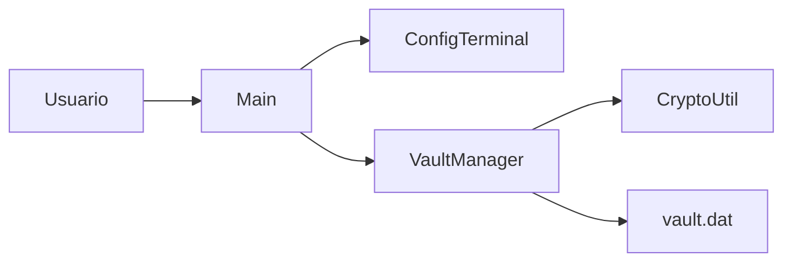
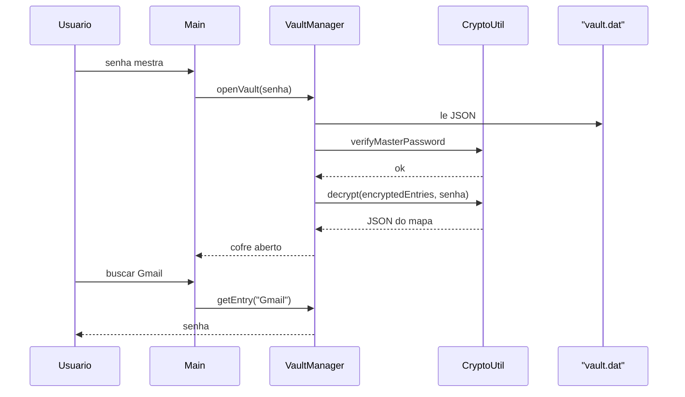

# Aula: o cofre de senhas da branch `sz_project`

> Documento no formato do comando `/explain` (modo professor).
> Projeto: protótipo de gerenciador de senhas em Java 21 + Maven.
> Commit de referência: `0893f1d prototipo do projeto cofre`.

---

## 1. Abertura

Antes de tudo, imagine que você tem dezenas de senhas — Gmail, Netflix, banco — e não quer anotá-las num bloco de notas. O projeto da branch `sz_project` é um **cofre no terminal**: um programa Java que guarda essas senhas num arquivo, trancadas por **uma única senha mestra**. Sem ela, o arquivo no disco é praticamente um tijolo.

---

## 2. Conceito central

Pense num **cofre de hotel**.

- A **senha mestra** é a chave da porta do cofre.
- O arquivo `vault.dat` é o cofre físico no quarto: qualquer um pode vê-lo, ninguém abre sem a chave.
- As senhas do Gmail, Netflix etc. são os objetos **dentro**.
- O menu do terminal é a recepção: você pede para guardar, buscar ou tirar algo.

Exemplo iniciante: na primeira execução, o programa pergunta "qual é a senha da porta?" duas vezes, cria o cofre vazio e só então deixa você guardar a senha do Gmail. Na próxima vez que o programa sobe, ele pergunta a chave de novo. Se estiver certa, abre; se estiver errada, o conteúdo continua ilegível.

O programa se divide em quatro peças, cada uma com um papel:

| Classe | Papel no hotel |
|---|---|
| `Main` | Recepção: fala com você, mostra o menu |
| `VaultManager` | Gerente do cofre: sabe o que tem dentro e quando gravar no disco |
| `CryptoUtil` | Cadeado: hasheia a chave e tranca/destranca o conteúdo |
| `ConfigTerminal` | Placa da recepção em UTF-8 (emojis no Windows) |

O usuário só conversa com `Main`. `Main` pede coisas a `VaultManager`. `VaultManager` chama `CryptoUtil` e grava `vault.dat`. Essa cadeia é o desenho inteiro do protótipo.



Arquivos:

- [`src/main/java/com/sxiii/Main.java`](../src/main/java/com/sxiii/Main.java) — menu CLI: criar/abrir cofre, adicionar, buscar, listar, remover
- [`src/main/java/com/sxiii/VaultManager.java`](../src/main/java/com/sxiii/VaultManager.java) — estado em memória (`Map` serviço → senha) e persistência em JSON
- [`src/main/java/com/sxiii/CryptoUtil.java`](../src/main/java/com/sxiii/CryptoUtil.java) — BCrypt na senha mestra; PBKDF2 + AES-GCM no conteúdo
- [`src/main/java/com/sxiii/ConfigTerminal.java`](../src/main/java/com/sxiii/ConfigTerminal.java) — `chcp 65001` no Windows para UTF-8/emojis
- [`pom.xml`](../pom.xml) — dependências `jbcrypt` e `gson`

---

## 3. Aprofundamento

Pense assim: por que **dois** mecanismos criptográficos, e não um só?

Porque eles resolvem perguntas diferentes.

### Pergunta 1 — "A senha que o usuário digitou é a senha mestra certa?"

Isso é **BCrypt**. Ele não "desfaz" a senha. Ele gera um hash (com salt interno, custo 12) e depois compara a tentativa com esse hash. Serve para **autenticar**. Não serve para recuperar o conteúdo do cofre.

```java
public static String hashMasterPassword(String masterPassword) {
    return BCrypt.hashpw(masterPassword, BCrypt.gensalt(12));
}

public static boolean verifyMasterPassword(String masterPassword, String hash) {
    return BCrypt.checkpw(masterPassword, hash);
}
```

### Pergunta 2 — "Como trancar o mapa de senhas no disco?"

Isso é **AES-GCM**, com chave derivada da senha mestra via **PBKDF2** (65.536 iterações, HMAC-SHA256, chave de 256 bits). A senha humana vira uma chave criptográfica de verdade. Salt de 16 bytes e IV de 12 bytes são aleatórios **a cada** criptografia. O blob gravado é:

```
Base64( salt (16 bytes) + IV (12 bytes) + ciphertext )
```

AES-GCM também **autentica**: senha errada ou arquivo adulterado faz a descriptografia falhar. Não devolve lixo silencioso.

### O formato do arquivo

O arquivo no disco **parece** JSON, mas o JSON é só o envelope. A classe interna `VaultData` tem dois campos:

```json
{
  "masterPasswordHash": "$2a$12$...",
  "encryptedEntries": "Base64(salt + IV + ciphertext)"
}
```

O mapa `serviço → senha` mora **dentro** de `encryptedEntries`, não à vista.

### Fluxo de persistência

1. Primeira execução: não existe `vault.dat` → confirma senha mestra → `createVault`.
2. `createVault` grava o hash BCrypt e o mapa (ainda vazio) já criptografado.
3. Próximas execuções: `openVault` verifica o hash, deriva a chave AES, solta o mapa na RAM.
4. Adicionar ou remover chama `saveVault` e **regrava o arquivo inteiro** criptografado de novo.

Na memória, o cofre aberto é um `HashMap<String, String>`. Buscar e listar leem esse mapa. Listar imprime **só as chaves** (nomes dos serviços), de propósito: a opção 3 do menu diz "sem senhas".

Um detalhe de palco: `ConfigTerminal` roda `chcp 65001` no Windows para o terminal aceitar UTF-8. Sem isso, as caixas e os emojis do menu viram caracteres quebrados.

---

## 4. Exemplo aplicado

Vamos resolver juntos: **guardar a senha do Gmail, sair, reabrir o cofre e buscar.**

**Passo 1 — Primeira execução.**
`Main` vê que `vault.dat` não existe. Pede senha mestra e confirmação. Se baterem, chama `vault.createVault(password)` e guarda a senha em `currentMasterPassword` (precisa dela depois para regravar o arquivo).

**Passo 2 — Criar o cofre.**
`createVault` hasheia a mestra com BCrypt, criptografa o JSON do mapa vazio (`{}`) com AES-GCM, monta um `VaultData` e escreve `vault.dat`.

**Passo 3 — Adicionar Gmail.**
No menu, opção 1. Você digita `Gmail` e a senha. `addEntry` faz `entries.put("Gmail", senha)` e chama `saveVault`. O mapa agora tem uma entrada; o arquivo é reescrito do zero, com novo salt, novo IV e novo ciphertext.

**Passo 4 — Sair.**
Opção 5. A mensagem diz "Cofre fechado". O que some é o mapa **na RAM**. O arquivo continua no disco, trancado.

**Passo 5 — Segunda execução.**
`vault.dat` existe. O programa pede a senha mestra. `openVault` lê o JSON e chama `verifyMasterPassword`. Se o BCrypt disser "não", para ali — nem tenta descriptografar. Se disser "sim", deriva a chave AES com o salt que está no blob, descriptografa, e o Gson reconstrói o `Map`.

**Passo 6 — Buscar.**
Opção 2, serviço `Gmail`. `getEntry` lê o mapa em memória e imprime a senha. Não precisa ir ao disco de novo: o cofre já está aberto.

Caminho completo dessa história:



---

## 5. Erros comuns

**Muita gente acha que BCrypt criptografa as senhas do Gmail/Netflix.**
Não. BCrypt só responde "essa é a senha mestra?". Quem tranca o conteúdo é AES-GCM. Sem os dois, ou você autentica sem proteger o arquivo, ou protege o arquivo sem um jeito barato de recusar senha errada antes de descriptografar.

**Muita gente abre `vault.dat` num editor, vê JSON e conclui que as senhas estão expostas.**
O JSON externo é o envelope. O mapa de senhas está no campo `encryptedEntries`, que é Base64 de bytes binários. Dá para *ler* o arquivo; não dá para *entender* o conteúdo sem a senha mestra.

**Muita gente acha que a opção 3 "listar sem senhas" está incompleta.**
Está desenhada assim. `listEntries` percorre `entries.keySet()` e não imprime os valores. É o equivalente a ver as etiquetas das gavetas sem abrir nenhuma.

**Bônus de palco:** ao sair, o arquivo não some. O que some é o mapa descriptografado na memória. "Fechar o cofre" no menu não apaga `vault.dat` — só encerra o processo.

---

## 6. Resumo final

- O projeto é um **cofre de senhas no terminal**: uma senha mestra protege várias senhas de serviços num arquivo `vault.dat`.
- **`Main`** é a interface; **`VaultManager`** é o estado + persistência; **`CryptoUtil`** é o cadeado; **`ConfigTerminal`** só ajusta UTF-8 no Windows.
- **BCrypt** autentica a senha mestra; **PBKDF2 + AES-GCM** tranca o mapa. São papéis diferentes, os dois necessários.
- O JSON no disco é um envelope (`hash` + `blob`). O mapa `serviço → senha` só existe em claro **depois** que o cofre abre na RAM.
- Adicionar ou remover **regrava o arquivo inteiro**, sempre com salt e IV novos.

**Leva pra casa:** ter o arquivo do cofre não é ter as senhas — a senha mestra é a única chave; o resto do programa só organiza a porta, o cadeado e o que vai para dentro.
